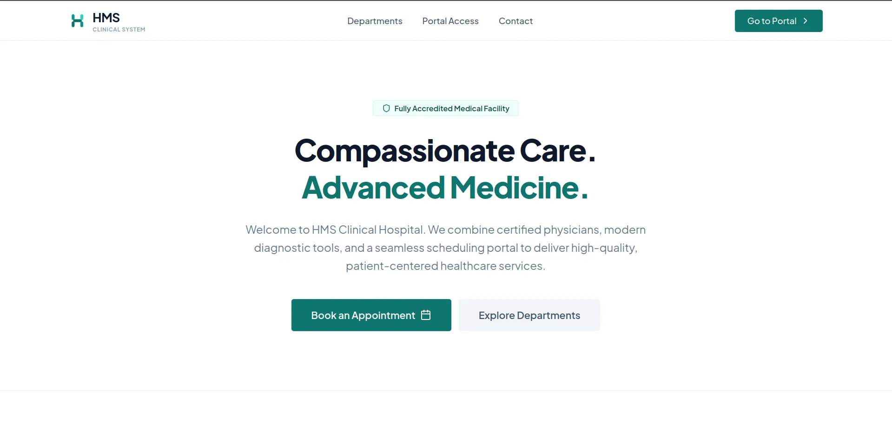
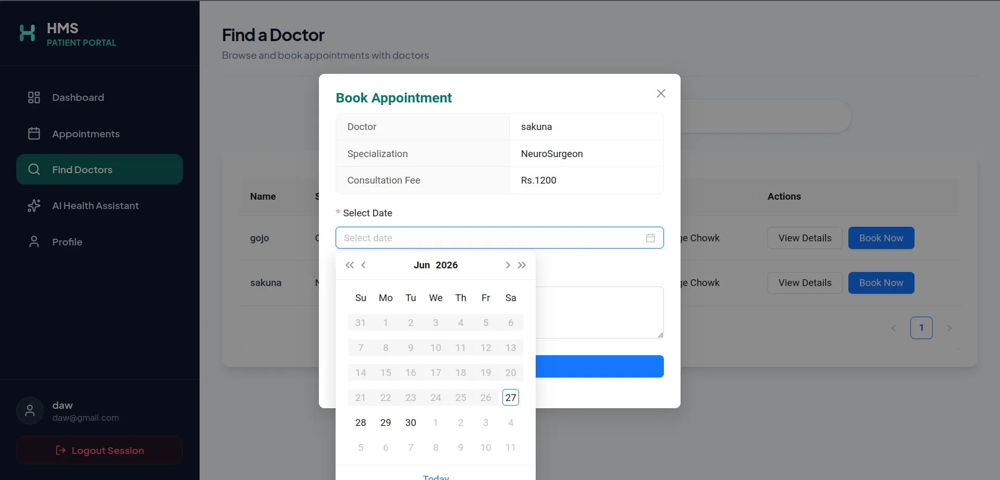
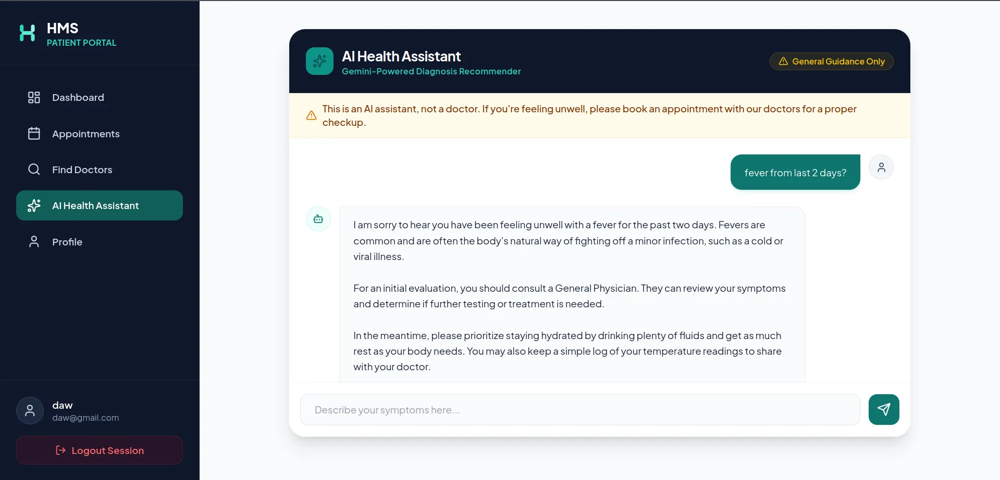
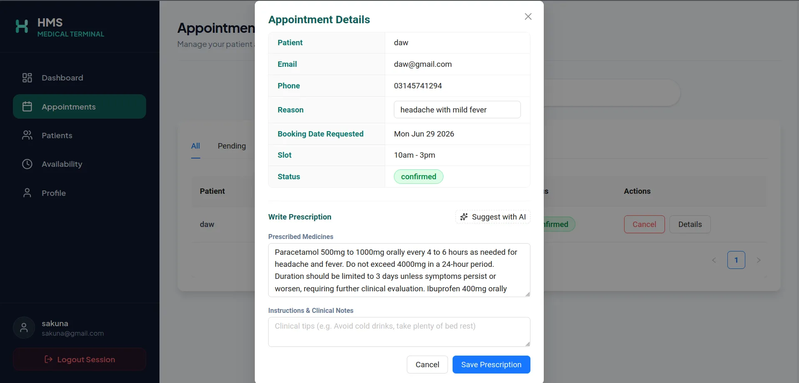
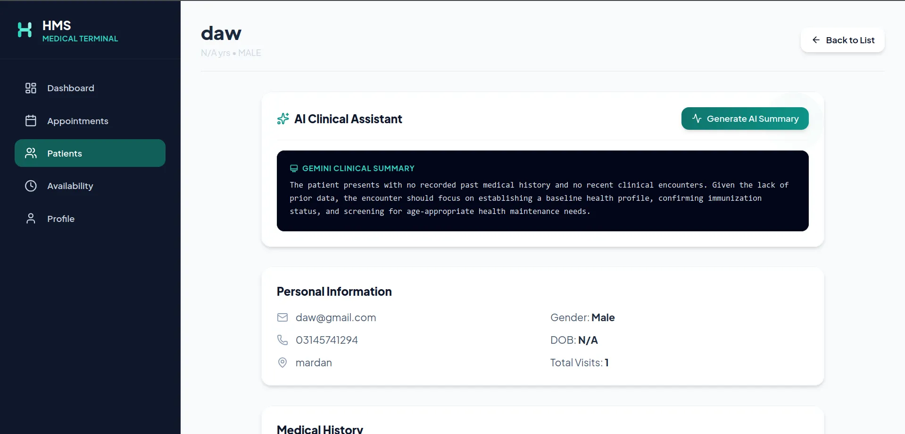
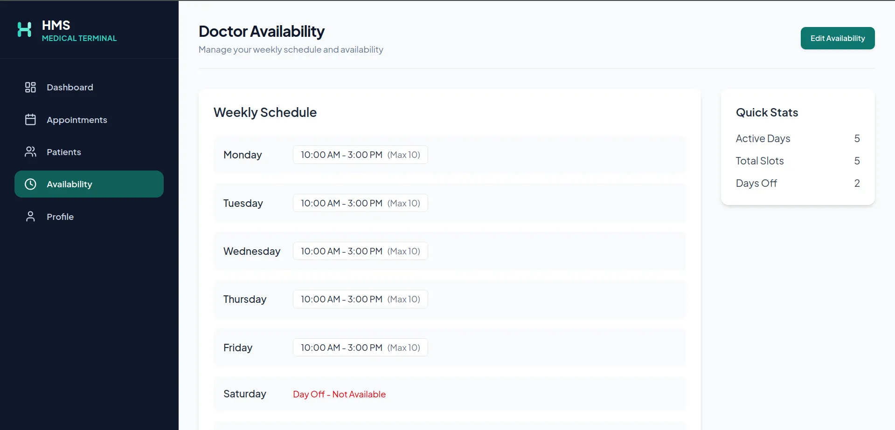
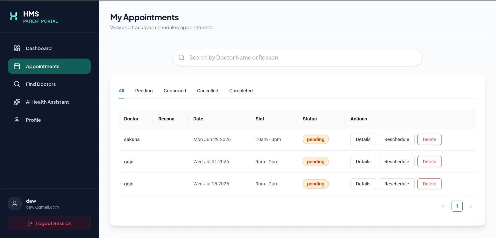
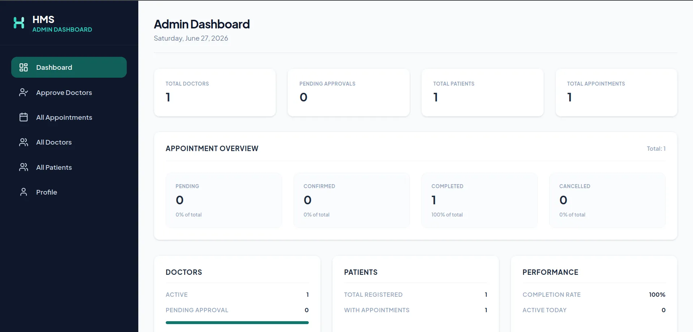

# Hospital Management System (HMS)

The Hospital Management System is a role-based healthcare web application. It facilitates interaction between patients, doctors, and system administrators. The application incorporates artificial intelligence to support clinical workflows, including patient symptom guidance, pre-consultation medical history synthesis, and draft prescriptions for physicians.

## Key Features

### Patient Portal
* **Symptom Advisor**: Patients describe their current symptoms in plain text. The system uses Gemini AI to suggest clinical specialties and provide home-care guidance.
* **Appointment Booking**: Users search for approved doctors, view available slots, and book appointments.
* **Profile Management**: Patients store and update their medical history, contact information, and appointment history.

### Doctor Portal
* **Dashboard and Analytics**: Doctors track their daily and weekly appointments alongside estimated revenue metrics.
* **Pre-Consultation Synthesis**: The system automatically summarizes the patient's medical history and appointment reason using Gemini AI to prepare the doctor.
* **Suggested Prescriptions**: Doctors receive AI-generated drug suggestions, dosages, and contraindication warnings based on the patient's history. Doctors can modify or override these suggestions before finalizing the prescription.
* **Availability Management**: Doctors configure their active consultation slots.

### Admin Portal
* **Credential Verification**: Admins review and approve or reject newly registered doctors.
* **System-Wide Auditing**: Admins access complete lists of appointments, patients, and registered doctors.
* **Profile Management**: Admins edit administrative credentials and manage dashboard settings.

## Technical Stack

### Frontend
* **React 19**: Component lifecycle management, custom hooks, and state coordination.
* **Redux Toolkit**: Centralized global store managing authentication, active profiles, and active appointment bookings.
* **Tailwind CSS 4**: Styled using the `@tailwindcss/vite` plugin for compiled utility classes and fast builds.
* **Ant Design (antd)**: Used for layout grids, interactive calendars, forms, notifications, and loading indicators.
* **React Router Dom**: Dynamic client-side routing and role-based route protection.
* **Axios**: HTTP client with interceptors to automatically attach JSON Web Tokens (JWT) to request headers.

### Backend
* **Express**: REST API routing, request parsing, and error-handling middleware.
* **Google Generative AI (`@google/generative-ai`)**: Implements client connections to Gemini models. Features a fallback mechanism querying models (`gemini-3.1-flash-lite`, `gemini-3-flash-preview`, `gemini-2.5-flash`, `gemini-2.0-flash`, `gemini-1.5-flash`) sequentially until a response is received. Includes a local simulation fallback when no API key is provided.
* **Authentication & Cryptography**: Authentication via JSON Web Tokens (JWT) stored in secure cookies. Password hashing uses `bcrypt`.
* **Security & Utility Middleware**:
  * `cors`: Configured to whitelist specific development origins.
  * `helmet`: Sets HTTP response headers to protect against common web vulnerabilities.
  * `express-rate-limit`: Prevents brute-force requests on authentication and general routes.
  * `customMongoSanitize`: Custom middleware in `app.js` that recursively deletes request payload properties containing `$` or `.` to block NoSQL injection attacks.
  * `compression`: Gzips responses to reduce bandwidth usage.
  * `nodemailer`: Dispatches notification emails to users.

### Database & Services
* **MongoDB**: Document database storing user, patient, doctor, and appointment collections.
* **Mongoose**: Object Document Mapper (ODM) enforcing schema validation and collection relationships.

## Local Development Setup

### Prerequisites
* Node.js v18 or higher
* MongoDB server running locally or hosted on MongoDB Atlas
* Google Gemini API Key (optional; simulation mode is active if key is missing)
* Gmail Account and App Password (optional; required for email dispatching)

### Repository Setup
Clone the repository to your local system and enter the project directory:
```bash
git clone https://github.com/your-username/hospital-management-system.git
cd hospital-management-system
```

### Backend Configuration

1. Navigate to the backend directory:
   ```bash
   cd backend
   ```
2. Create a `.env` file in the root of the `backend` directory using the template below:
   ```env
   MONGO_URI=mongodb://127.0.0.1:27017
   PORT=5000
   JWT_SECRET=your_jwt_secret_key_here
   ADMIN_EMAIL=admin@hms.com
   EMAIL_USER=your_gmail_address@gmail.com
   EMAIL_PASSWORD=your_gmail_app_password
   GEMINI_API_KEY=your_gemini_api_key_here
   ```
3. Install dependencies:
   ```bash
   npm install
   ```
4. (Optional) Run the database seed script to initialize the default admin account:
   ```bash
   node seed.js
   ```
   *Note: The application also auto-seeds a default admin account (`admin@hms.com` with password `admin123456`) on initial startup.*
5. Start the development server:
   ```bash
   npm run dev
   ```

### Frontend Configuration

1. Open a new terminal and navigate to the frontend directory:
   ```bash
   cd frontend
   ```
2. Create a `.env` file in the root of the `frontend` directory using the template below:
   ```env
   VITE_API_URL=http://localhost:5000
   ```
3. Install dependencies:
   ```bash
   npm install
   ```
4. Start the development server:
   ```bash
   npm run dev
   ```

## Visual Preview

The following screenshots demonstrate the user interface, doctor scheduling, and AI assistant capabilities.








